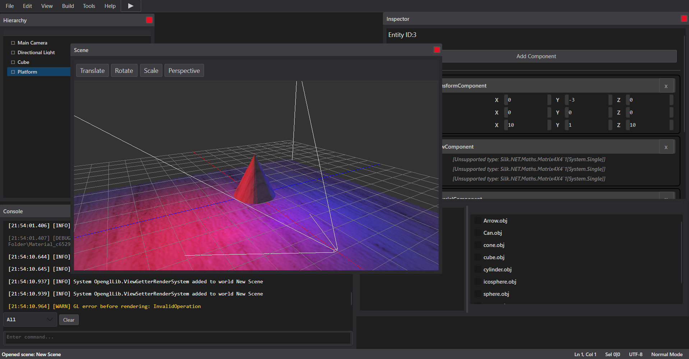

# 🎮 ECS OpenGL Engine

A C# game engine with Entity-Component-System (ECS) architecture and OpenGL rendering.

## 📌 Possibilities

1. 🔥 Flexible and modular ECS system.

2. 🏎 High-performance rendering via OpenGL (Silk.net).

3. 🎭 Support for 3D objects, shaders and textures. (Using a generator to create an instance of a shader representation in C#)

4. 🎵 Sound management (OpenAL).

5. 🎮 Support for keyboard, mouse and gamepad input.

6. 🔄 Simple object update and event handling system.